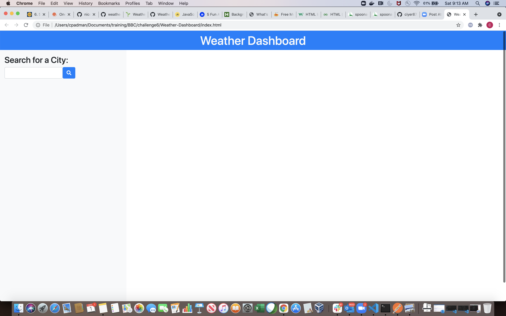
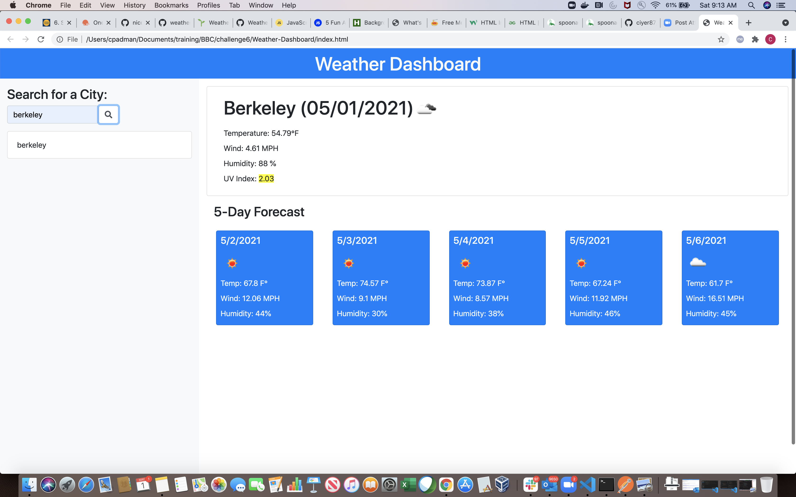
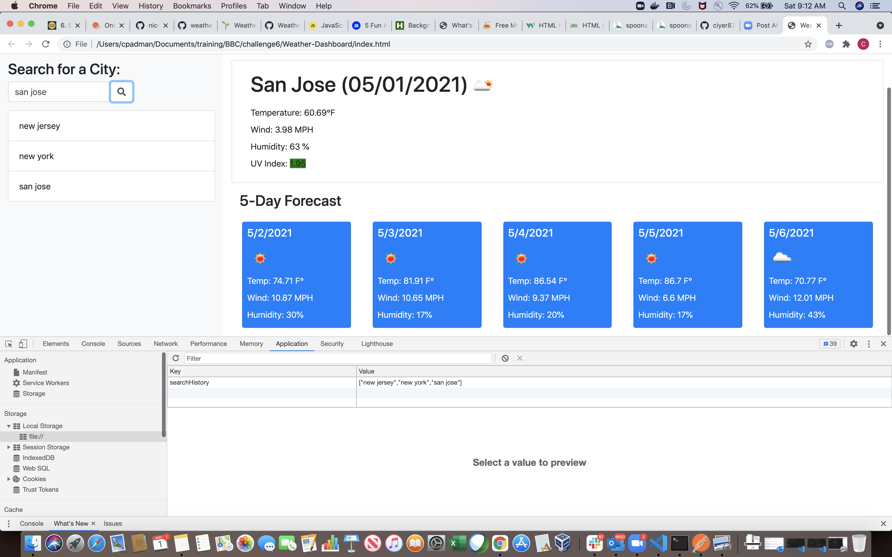
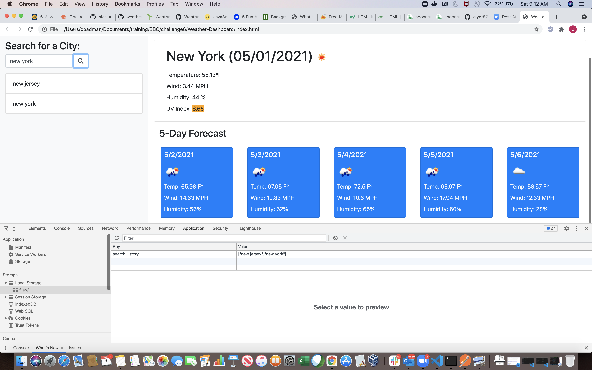

# Weather-Dashboard

An app to fetch and display weather information from OpenWeather for multiple cities to aid travelers in trip planning.

Deployed at: https://ciyer87.github.io/Weather-Dashboard/

# Features

* Provides a simple search form that accepts a city name
* Searching for a city presents the user with current and future conditions for that city using the OpenWeather API to retrieve weather data
* Searched cities are stored in local storage and search is accessible via buttons below the search form
* Selecting a city in the search history displays the current and future conditions for that city as of the current date
* Current weather conditions for a city are dispayed with the city name, current date, an icon representing the weather conditions, temperature, humidity, wind   speed, and UV index
* The UV index is styled with a color that indicates the risk
* Future weather conditions for the city are presented as a 5-day forecast that includes the date, an icon representing the weather conditions, temperature, wind speed, and humidity for each day

# Screenshots

* Landing page

  
  
* Current and future weather condition for a city

  
  
* local storage that stores the city name

  
  
* search history

  
